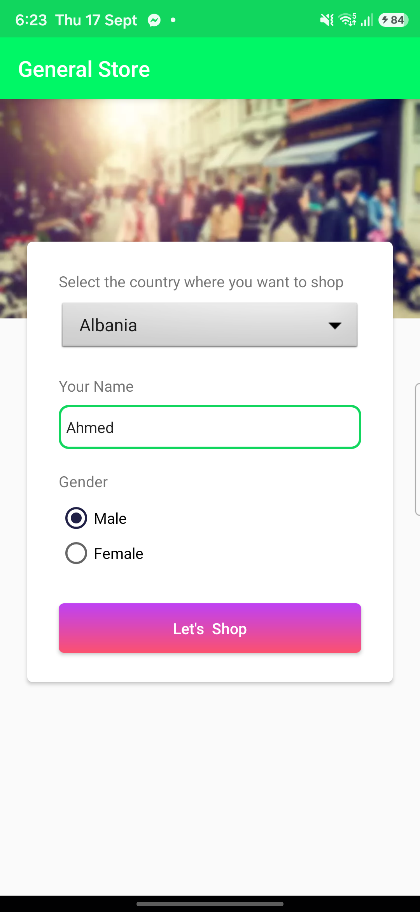
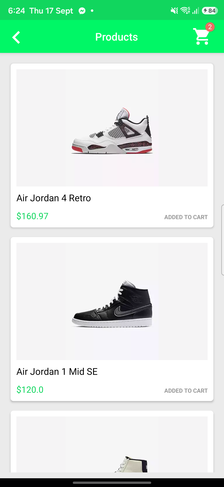
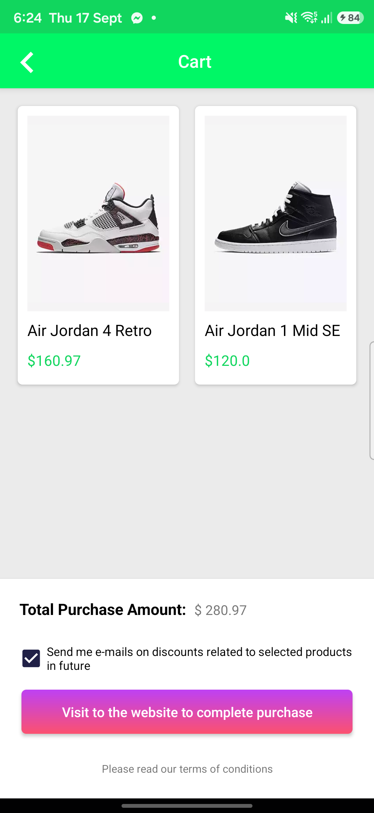

# Mobile Automation — General Store E2E with Maestro

[](https://maestro.dev)
[](#prerequisites)
[](#running-the-tests)
[](#license)

End-to-end UI automation for the **General Store** Android sample app, written with
[Maestro](https://maestro.dev). The suite drives the full purchase journey —
onboarding form → product catalogue → cart verification → web checkout — using
data-driven flows, reusable per-screen subflows and JavaScript business-rule assertions.

<p align="center">
  
  &nbsp;
  
  &nbsp;
  
</p>

---

## Table of contents

- [What is covered](#what-is-covered)
- [Project structure](#project-structure)
- [Prerequisites](#prerequisites)
- [Running the tests](#running-the-tests)
- [Test data & datasets](#test-data--datasets)
- [Reports & artifacts](#reports--artifacts)
- [Design decisions](#design-decisions)
- [Conventions](#conventions)
- [Troubleshooting](#troubleshooting)
- [Roadmap](#roadmap)

---

## What is covered

The single orchestrator flow [`flows/e2e-complete-order.yaml`](flows/e2e-complete-order.yaml)
walks the business journey end to end:

| # | Screen | Verified behaviour |
|---|---|---|
| 1 | Launch | Clean state, landing screen rendered |
| 2 | Onboarding form | Country dropdown selection, name input (focus + value), gender radio group, submit |
| 3 | Products | Empty-cart badge hidden, each product's `ADD TO CART` → `ADDED TO CART`, badge count increments, prices captured |
| 4 | Cart | Every selected product listed, **total equals the sum of captured prices** (JS assertion), Terms dialog via long-press, e-mail opt-in checkbox |
| 5 | Checkout | Hand-off to the WebView, query submitted, results shown, app resets to the landing screen |

Each stage records a screenshot and the whole run is captured on video.

## Project structure

```
.
├── config.yaml                     # Maestro workspace: which files are runnable flows
├── run-e2e.bat                     # One-click runner (Windows): run + open HTML report
│
├── flows/
│   └── e2e-complete-order.yaml     # Orchestrator: wires subflows in business order
│
├── subflows/                       # One folder per screen — the "Page Object" layer
│   ├── common/launch-app-clean.yaml
│   ├── onboarding/complete-onboarding.yaml
│   ├── products/add-product-to-cart.yaml
│   ├── cart/
│   │   ├── open-and-verify-cart.yaml
│   │   ├── review-terms.yaml
│   │   └── checkout.yaml
│   └── order/complete-order-on-web.yaml
│
├── data/
│   └── testdata.js                 # Named datasets (user, products, options)
├── scripts/
│   └── assert-cart-total.js        # Business-rule assertion: total == Σ prices
│
├── docs/screenshots/               # Images used in this README
├── General-Store.apk               # Application under test
└── results/                        # Generated on each run (git-ignored)
```

**Flows** own the *what* (business order). **Subflows** own the *how* (selectors and
screen-level assertions). **Data** owns the *with what*. Changing a selector touches one
subflow; changing the scenario touches one flow; changing inputs touches one dataset.

## Prerequisites

| Tool | Version | Notes |
|---|---|---|
| [Maestro CLI](https://docs.maestro.dev/getting-started/installing-maestro) | ≥ 2.10 | `maestro --version` |
| Java | 17 or 21 | Required by Maestro |
| Android SDK platform-tools | any recent | `adb` must be on `PATH` |
| Android device or emulator | API 26+ | USB debugging enabled and authorised |

Install the app under test once:

```bash
adb install General-Store.apk
```

Confirm the device is visible:

```bash
adb devices
```

## Running the tests

### One command (Windows)

```bash
./run-e2e.bat
```

Runs the E2E flow and opens the HTML report automatically when it finishes.

### Manual

```bash
maestro test --format HTML-DETAILED --output results/report.html --test-output-dir results .
```

### Useful variants

```bash
# Another dataset (see data/testdata.js)
maestro test -e DATASET=austria_female .

# Filter by tag
maestro test --include-tags smoke .
maestro test --exclude-tags network .

# JUnit XML for CI dashboards
maestro test --format JUNIT --output results/junit.xml .
```

Typical duration on a physical mid-range Android device: **~1 min 15 s** for the full
journey including video recording and five screenshots.

## Test data & datasets

Maestro's JavaScript sandbox cannot read files, so datasets live in
[`data/testdata.js`](data/testdata.js) and are loaded with `runScript` at the start of
the flow. Every flow and subflow then reads them from the shared `output` object:

```js
var datasets = {
  default: {
    user: { country: "Albania", name: "Ahmed", gender: "Male" },
    products: [{ name: "Air Jordan 4 Retro" }, { name: "Air Jordan 1 Mid SE" }],
    optInToEmails: true,
    searchQuery: "General Store"
  },
  austria_female: { /* ... */ }
};
```

```yaml
- runFlow:
    file: ../subflows/onboarding/complete-onboarding.yaml
    env:
      COUNTRY:   ${output.data.user.country}
      USER_NAME: ${output.data.user.name}
      GENDER:    ${output.data.user.gender}
```

Add a dataset by adding a key to `datasets`; select it with `-e DATASET=<key>`.

## Reports & artifacts

Each run writes to `results/` (git-ignored):

```
results/
├── report.html                                   # Summary + every step with status and duration
└── <timestamp>/<flow name>/
    ├── takeScreenshot/01_onboarding_form_filled.png
    ├── takeScreenshot/02_products_added.png
    ├── takeScreenshot/03_cart_ready_for_checkout.png
    ├── takeScreenshot/04_order_completed_web.png
    ├── takeScreenshot/05_post_order_landing.png
    ├── startRecording/e2e_onboarding_to_order.mp4
    ├── screenshots/                              # Auto-captured on any failing step
    ├── logs/maestro.log
    └── commands.json                             # Machine-readable step log
```

The HTML report lists every step with its duration, which is also the quickest way to
find performance regressions in the suite itself (see *Design decisions*).

## Design decisions

- **Orchestrator + subflows.** The E2E flow contains no selectors. Each screen's
  interactions and assertions live in one subflow with a documented parameter list.
- **No `env:` defaults inside subflows.** On Maestro 2.10 a subflow's own `env` block
  overrides values passed by `runFlow`; defaults therefore live only in the dataset.
- **IDs over text.** Selectors use `resource-id` wherever the app exposes one; text is
  used only for elements without an id (checkbox, dialog buttons). All ids were taken
  from `maestro hierarchy`, not guessed.
- **Assertions that can fail.** Gender switches away from the pre-selected default;
  the cart badge is asserted *absent* before adding; the total is computed from prices
  captured at add-time rather than hard-coded.
- **Business rules in JavaScript.** `scripts/assert-cart-total.js` sums captured prices
  and throws a descriptive error on mismatch — a pattern for any rule that YAML cannot
  express.
- **Fast by measurement.** The default country was moved from *Egypt* to *Albania*
  after the step report showed a 30 s scroll (every `scrollUntilVisible` step re-reads
  the device hierarchy). Run time dropped from 1 m 45 s to 1 m 13 s.
- **Network steps are guarded.** The web checkout uses `extendedWaitUntil` with an
  explicit timeout and asserts only the app's own navigation, not third-party content.

## Conventions

- One scenario per flow file; Maestro stops a flow at its first failure.
- `name:` reads like a test-case title — it is what the report shows.
- `label:` on every step so the report reads as a narrative, not as raw commands.
- Tags: `smoke`, `regression`, `e2e`, `checkout`, `network`.
- Subflow header comment lists **Parameters**, **Reads** and **Writes**.
- No trailing whitespace; two-space indentation; quotes on all selector strings.

## Troubleshooting

| Symptom | Cause / fix |
|---|---|
| `Not enough devices connected (0)` | `adb devices` shows nothing or `unauthorized` — accept the USB-debugging prompt on the phone |
| `Device server died during 'launchApp'` | Stale Maestro driver — unplug/replug the device or `adb kill-server && adb start-server` |
| `No visible element found: "<country>"` in the dropdown | `scrollUntilVisible` overshot: lower `speed` or choose a country on the first page |
| Parsing failed on a `$` value | Wrap in single quotes: `text: '$ 280.97'` — `\$` is invalid in YAML double quotes |
| Report opened but no `startRecording` video | Device does not support `adb screenrecord`; Maestro still records to `videos/` |

## Roadmap

- [ ] GitHub Actions workflow on an Android emulator (`reactivecircus/android-emulator-runner`)
- [ ] Per-screen regression suite alongside the E2E journey
- [ ] Negative scenarios (empty name validation toast, network-off checkout)
- [ ] iOS build of the sample app

## License

MIT — see [LICENSE](LICENSE). The General Store APK is a public sample application used for
learning purposes and remains the property of its authors.
